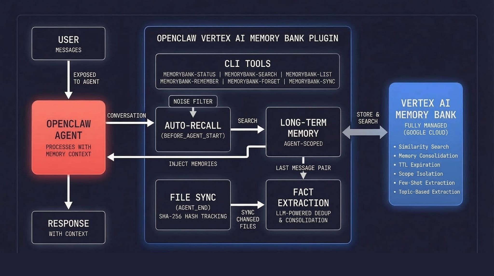

# openclaw-vertex-memorybank

Managed long-term memory for your OpenClaw agents, powered by [Vertex AI Memory Bank](https://docs.cloud.google.com/agent-builder/agent-engine/memory-bank/overview).

### Why you need memory beyond OpenClaw core

OpenClaw's built-in memory is per-agent and per-session. This plugin adds **user-scoped memory that works across all your agents** — so when you tell one agent your preferences, every agent remembers. Scope by user, by project, or however you want. Your agent's memory grows with you, not with each individual chat.

### Why Vertex AI Memory Bank

Built by Google DeepMind & Google Cloud. Fully managed — no vector database to run, no embeddings to maintain, no infrastructure to monitor. Your data stays in your GCP project, private by default. Generous free tier (1,000 retrievals/month free). The extraction and consolidation LLM handles deduplication, contradiction resolution, and fact merging automatically.

### Token-efficient and effective

Memories are extracted facts, not raw conversation logs. Only relevant memories are injected per turn via similarity search — not your entire history. The result: your agent gets better context in fewer tokens. Don't trust us — compare recall quality and token usage yourself.

---



## What It Does

This plugin gives your OpenClaw agent **persistent, cross-session memory** using Vertex AI's Memory Bank:

- **Auto-recall**: Before each turn, relevant memories are retrieved via similarity search and injected into context
- **Auto-capture**: After each turn, the last message pair is sent to Memory Bank for fact extraction and storage
- **Noise filtering**: Short/trivial exchanges are automatically skipped. Few-shot examples teach Memory Bank what to extract vs ignore
- **Relevance threshold**: Low-similarity memories are filtered out before injection, keeping context clean
- **File sync**: Workspace files (MEMORY.md, USER.md, SOUL.md, etc.) are automatically synced to Memory Bank with hash-based change tracking
- **Topic sync**: Memory topics, perspective, and few-shot examples are auto-configured on the Agent Engine instance at startup
- **Agent tools**: Search, forget, correct, and inspect memory stats directly from conversation
- **CLI tools**: Search, create (via consolidation pipeline), and delete memories directly from the command line
- **Managed infrastructure**: No vector DB, no local database. Google handles storage, embeddings, extraction, and retrieval

> **Note:** This plugin runs _alongside_ OpenClaw's built-in `memory-core`. It adds cloud-backed long-term memory on top.

## Prerequisites

1. **Google Cloud project** with billing enabled and Vertex AI API enabled
2. **Agent Engine instance** created for Memory Bank:
   ```bash
   pip install google-cloud-aiplatform>=1.111.0
   ```
   ```python
   import vertexai
   client = vertexai.Client(project="YOUR_PROJECT", location="us-central1")
   agent_engine = client.agent_engines.create()
   print(agent_engine.api_resource.name)  # Save the reasoning engine ID
   ```
3. **gcloud CLI** authenticated:
   ```bash
   gcloud auth application-default login
   ```

## Installation

### 1. Add plugin config to `openclaw.json`

Add the config **before** installing — the plugin requires three fields to validate during install:

```json
{
  "plugins": {
    "entries": {
      "openclaw-vertex-memorybank": {
        "enabled": true,
        "config": {
          "projectId": "your-gcp-project-id",
          "location": "us-central1",
          "reasoningEngineId": "your-reasoning-engine-id"
        }
      }
    }
  }
}
```

### 2. Clone, build, install

```bash
git clone https://github.com/Shubhamsaboo/openclaw-vertexai-memorybank.git
cd openclaw-vertexai-memorybank
npm install && npm run build
openclaw plugins install .
```

<!-- TODO: Alternative install via https://clawhub.ai/ when published -->

### 3. Trust the plugin (recommended)

After install, add `plugins.allow` to your `openclaw.json` to explicitly trust the plugin and silence the "non-bundled plugin auto-load" warning:

```json
{
  "plugins": {
    "allow": ["openclaw-vertex-memorybank"],
    "entries": { ... }
  }
}
```

> **Why not add `allow` in step 1?** OpenClaw validates that allowed plugins are actually installed — adding it before install causes a validation error.

### 4. Restart

```bash
openclaw restart
```

The plugin loads on gateway startup — a restart is required after install.

### Bootstrapping from existing sessions

After install, your agent starts with an empty memory. To catch up on context from past conversations, ask your agent:

> *"Generate memories from my last few days of sessions."*

The agent can parse your session history and backfill Memory Bank with extracted facts. This gives you immediate value — your agent will recall decisions, preferences, and context from recent work without waiting for new conversations to build up memory organically.

## How It Works

```
User message arrives
        |
        v
  [before_agent_start]    Retrieve top-K memories via similarity search,
  (auto-recall)           filter by relevance threshold,
                          prepend to agent context
        |
        v
   Agent processes
   the message
        |
        v
  [agent_end]             Check message length (noise filter)
  (auto-capture)          If substantive: send last message pair
                          to Memory Bank for extraction
        |
  [agent_end]             Scan workspace files for changes
  (file sync)             and sync changed files to Memory Bank
```

- **Recall** uses semantic similarity search scoped to your configured scope. Optional `maxDistance` threshold filters out low-relevance results
- **Capture** sends only the last user+assistant message pair (not the full conversation), so each turn is processed exactly once with zero overlap
- **Noise filter** skips capture when user message < 20 chars or total < 100 chars (filters "done?", "?", "ok" type exchanges)
- **Few-shot examples** teach Memory Bank's extraction LLM what to capture (decisions, preferences) and what to ignore (status checks, debugging chatter)
- **File sync** tracks SHA-256 hashes of workspace files and only re-syncs when content changes
- **Topic sync** auto-configures memory topics, perspective, and few-shot examples on the Agent Engine instance at startup
- **Consolidation** is handled by Memory Bank for all write paths — conversation capture, file sync, and direct writes (`memorybank-remember`) all route through `GenerateMemories` with `direct_memories_source`. When a new fact contradicts an existing memory, it updates in place (e.g., "repo has 91K stars" becomes "repo has 100K stars"). No facts bypass the consolidation pipeline
- Authentication uses Google Application Default Credentials (ADC)

## Configuration

| Option | Type | Default | Description |
|--------|------|---------|-------------|
| `projectId` | string | **(required)** | GCP project ID or number |
| `location` | string | **(required)** | GCP region (e.g. `us-central1`) |
| `reasoningEngineId` | string | **(required)** | Agent Engine reasoning engine ID |
| `scope` | object | `{"agent_name": "openclaw"}` | Memory scope for isolation. Exact-match on all keys. See [Memory Scoping](#memory-scoping) |
| `autoRecall` | boolean | `true` | Retrieve memories before each turn |
| `autoCapture` | boolean | `true` | Extract memories after each turn |
| `autoSyncFiles` | boolean | `true` | Sync workspace markdown files |
| `autoSyncTopics` | boolean | `true` | Auto-configure topics on startup |
| `memoryTopics` | array | (see below) | Custom memory topics |
| `perspective` | `"first"` \| `"third"` | `"third"` | Memory perspective |
| `topK` | number | `10` | Max memories per query |
| `maxDistance` | number | none | Max similarity distance for recall. Lower = stricter. Memories above this are filtered out |
| `backgroundGenerate` | boolean | `true` | Non-blocking capture |
| `ttlSeconds` | number | none | Auto-expire memories (seconds). Default: no expiry |
| `introspection` | `"off"` \| `"scores"` | `"scores"` | Metadata in auto-recalled memories. `"off"` = just facts, `"scores"` = facts + similarity score |

### Default Memory Topics

The plugin configures six topics by default (3 managed + 3 custom):

**Managed:** USER_PREFERENCES, EXPLICIT_INSTRUCTIONS, KEY_CONVERSATION_DETAILS

**Custom:**
- `technical_decisions`: Architecture choices, tool evaluations, technology selections
- `project_context`: Project names, repos, team members, roles, configurations
- `action_items`: Tasks, deadlines, commitments, follow-ups

Each custom topic includes "Do NOT include" clauses to reduce noise (e.g., routine status checks, temporary error messages).

### Few-Shot Examples

The plugin ships with built-in few-shot examples that teach Memory Bank's extraction LLM:

- **What to capture**: User preferences, explicit instructions, architecture decisions
- **What to skip**: Short status checks ("done?"), debugging chatter, operational acknowledgments

You can override these by providing your own `memoryTopics` array with custom few-shot examples.

### Memory Scoping

The `scope` field controls memory isolation. It's an arbitrary key-value object — you define the keys. **Scope matching is exact**: memories are only returned when all scope keys match exactly, and consolidation (dedup, contradiction resolution) only happens within the same scope.

This means scope determines both **who can see** a memory and **what gets merged together**.

**Recommended: scope by `user_id` only** for cross-agent memory sharing:

```json
// Recommended: shared across all agents for the same user
{ "user_id": "shubham" }

// Per-agent (memories won't be shared between agents)
{ "agent_name": "openclaw" }

// Per-user + per-agent (most isolated)
{ "user_id": "shubham", "agent_name": "openclaw" }
```

> **Tip:** If you scope as `{user_id: "alan", agent_name: "zaf"}`, memories created by agent "zaf" won't be found by agent "helper" for the same user. Use `user_id`-only scoping unless you specifically want agent isolation.

Scope is **immutable** once set on a memory — choose your scoping strategy before backfilling. See the [Memory Bank scoping documentation](https://docs.cloud.google.com/agent-builder/agent-engine/memory-bank/overview#memory-scope) for more details.

## Agent Tools

The plugin registers four tools that the agent can call directly during conversation:

| Tool | Description |
|------|-------------|
| `memory_search` | Semantic search — returns facts with similarity scores, topics, timestamps, and memory IDs |
| `memory_forget` | Delete a specific memory by ID. Useful when the agent discovers outdated or incorrect information |
| `memory_correct` | Update a memory's fact text in place (PATCH, with delete+regenerate fallback if PATCH fails) |
| `memory_stats` | Total memory count, breakdown by topic, and scope info. Uses lightweight field-masked counting |

These use `api.registerTool()` and are available to the agent automatically when the plugin is enabled.

**Example interaction:** *"What do you remember about my deployment setup?"* → agent calls `memory_search` with that query and gets back ranked results with scores. *"That's wrong, I moved to us-east1"* → agent calls `memory_correct` to fix it.

### Introspection

The `introspection` config controls what metadata appears in auto-recalled memories:

- **`"scores"` (default)**: Each memory includes its similarity score, helping the agent weigh relevance
- **`"off"`**: Just the facts, no metadata. Use for token-conscious setups

## CLI Commands

### `memorybank-status`
Show plugin config, connection status, and file sync state.

### `memorybank-search <query> [--top-k N] [--show-ids]`
Search memories by semantic similarity. Shows distance scores. Use `--show-ids` to reveal memory IDs (needed for deletion).
```bash
openclaw memorybank-search "project architecture decisions" --top-k 5 --show-ids
```

### `memorybank-list [--show-ids] [--count-only]`
List all memories in the current scope. Use `--show-ids` to reveal memory IDs. Use `--count-only` for a fast, lightweight count using field-masked API calls (no full memory objects fetched).

### `memorybank-remember <fact>`
Store a fact via Memory Bank's consolidation pipeline (`GenerateMemories` with `direct_memories_source`). The fact goes through the same deduplication, contradiction resolution, and merging as conversation-captured memories — it's never a raw insert. Useful for cron jobs, scripts, or seeding initial knowledge.
```bash
openclaw memorybank-remember "The deployment uses us-central1 region"
```

### `memorybank-forget <memoryId>`
Delete a specific memory by ID. Find IDs using `--show-ids` with search or list.
```bash
openclaw memorybank-search "wrong fact" --show-ids
# 1. Some incorrect memory (id: 1234567890)

openclaw memorybank-forget 1234567890
```

### `memorybank-sync`
Manually trigger file sync (useful after bulk file edits).

## Pricing

Vertex AI Memory Bank pricing (as of 2026):

| Resource | Cost | Notes |
|----------|------|-------|
| **Memory storage** | $0.25 per 1,000 memories / month | Scales with memory count |
| **Memory retrieval** | $0.50 per 1,000 memories returned | First 1,000/month **free** |
| **Memory generation** | Gemini token costs only (~$0.0003–$0.001/call) | No per-call API fee |

**Example monthly cost (single user, ~50 turns/day):**
- Storage: ~$0.25 (1K memories)
- Retrieval: ~$7 (50 retrievals/day × 30 days, minus free tier)
- Generation: ~$0.50 (capture + file syncs)
- **Total: ~$8/month**

For most personal/small-team usage, costs are minimal. Retrieval is the largest line item at scale — consider caching if you run multiple agents.

See [Vertex AI pricing](https://cloud.google.com/vertex-ai/pricing#vertex-ai-agent-engine) and [FAQ.md](FAQ.md) for detailed cost breakdowns.

## Development

```bash
npm install
npm run build
openclaw plugins install .
```

## License

[MIT](LICENSE)
